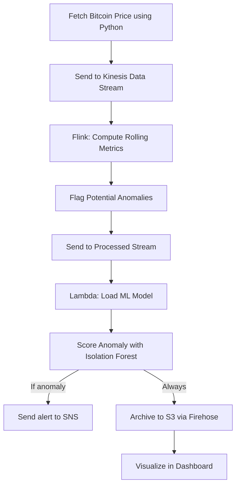

# Real-Time Bitcoin Price Anomaly Detection Using Amazon Kinesis

## Project Overview
This project demonstrates a real-time anomaly detection pipeline for Bitcoin price data using the AWS ecosystem. It utilizes Amazon Kinesis, AWS Lambda, Apache Flink, Amazon S3, Amazon SNS, and a dashboarding tool (Plotly Dash or AWS QuickSight) to detect and visualize price anomalies in real time.

---

## Technologies Used

| Technology        | Purpose                                                  |
|------------------|----------------------------------------------------------|
| Amazon Kinesis    | Real-time data ingestion (Data Streams, Firehose)       |
| AWS Lambda        | Anomaly detection using a pre-trained ML model          |
| Amazon S3         | Archiving raw and processed data                        |
| Apache Flink      | Stream processing: computing rolling metrics            |
| Amazon SNS        | Alerting on severe anomalies                            |
| Plotly Dash / QuickSight | Dashboard visualization of price trends & anomalies |
| Docker + Python   | For packaging dependencies for AWS Lambda               |

---

## Project Workflow

### 1. **Data Ingestion**
- A Python script fetches real-time Bitcoin price and volume data using the CoinGecko API.
- The script sends the data (timestamp, price, volume) to an Amazon Kinesis Data Stream named `bitcoin-price-stream` using `boto3`.

### 2. **Stream Processing with Apache Flink**
- A Flink application consumes records from the `bitcoin-price-stream`.
- It computes rolling statistics like moving averages and standard deviation.
- Flags records as outliers if the price deviates more than 3σ from the rolling mean.
- Anomalous and non-anomalous records are sent to a second Kinesis stream (processed-data-stream).

### 3. **Machine Learning with AWS Lambda**
- A pre-trained Isolation Forest model (saved using `joblib`) is deployed in AWS Lambda.
- The Lambda function is triggered by the `processed-data-stream`.
- For each record:
  - It calculates an anomaly score.
  - If the score is above the threshold, the function:
    - Publishes an alert to an Amazon SNS topic.
    - Archives the record to an S3 bucket via Kinesis Firehose.

### 4. **Storage & Archiving**
- Kinesis Firehose writes all processed records (raw + anomalies) into an Amazon S3 bucket named `btc-anomaly-data/`.
- The data is partitioned by date for historical analysis.

### 5. **Visualization**
- Option 1: Plotly Dash App (hosted on EC2 or Streamlit)
  - Reads data from S3.
  - Plots price trends, anomaly points, volume over time.
  - Supports filtering by date.
- Option 2: AWS QuickSight
  - Connects to S3 or Athena.
  - Creates interactive dashboards with visual anomaly indicators.

---

## Flowchart

## Deployment Notes
### Lambda Packaging
- Built inside the official AWS Lambda Python 3.9 Docker image to ensure compatibility.
- Used Python 3.9 with numpy==1.19.5, scikit-learn==0.24.2, and joblib.
- All dependencies were installed into a /python folder and zipped with the handler and model files.
- Final ZIP was uploaded to an S3 bucket and deployed to Lambda.

## Data Simulation:
- Price anomalies simulated by injecting extreme values in the Python data ingestion script

- Used to verify anomaly score sensitivity in Lambda

## Model Tuning:
- Isolation Forest trained on historical CoinGecko data

- Anomaly threshold tuned based on score distribution from normal and anomalous samples

## Output Examples
✅ SNS Email Alert: "Anomaly Detected: BTC at $999999"

✅ CloudWatch Log: "Anomaly Score: -0.32 | Flagged: True"

✅ S3 Entry: btc-anomaly-data/2025/05/17/hour=13/data.json

✅ Dashboard Plot: Price spike marked in red with tooltip

## Future Enhancements
- Integrate additional features: moving average delta, Bollinger Bands

- Switch to Autoencoder for richer anomaly detection

- Extend to multi-coin analysis (BTC, ETH, LTC)

- Deploy dashboard to public-facing platform for monitoring

### Authors
You – Project Lead and Developer

AWS Docs – Platform References

CoinGecko API – Price Source
